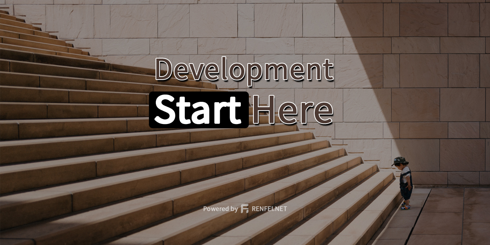

[English](README.md) | [简体中文](README_zh_CN.md)

# start



[](https://github.com/renfei/start/actions/workflows/build.yml)
[](https://travis-ci.com/github/renfei/start)
[](https://coveralls.io/github/renfei/start?branch=master)
[](https://codebeat.co/projects/github-com-renfei-start-master)


With the accumulation of work experience, more and more projects in work and private projects need to be started, and
the repetitive content bores me, while maintaining many versions of the code. This project was born. It is not a
complete project but exists as a template project and a code baseline. In my future work and private projects, I will
use this project as the baseline version and add my own business code on top of it.

## Project Repository

- Github: [https://github.com/renfei/start](https://github.com/renfei/start)
- Gitee: [https://gitee.com/rnf/start](https://gitee.com/rnf/start)
- Gitlab: [https://gitlab.com/renfei/start](https://gitlab.com/renfei/start)

## Technology Selection

### Spring Boot

Spring , this is no need to explain, this reason is enough. This has nothing to do with Spring's IoC, DI, and AOP. The
trend in the industry is to use Spring. It must be Spring Boot. I don’t want to toss a bunch of XML configuration files.

### Mybatis

Foreigners like Spring Data JPA, and Chinese prefer Mybatis. JPA is very good, but the design idea of JPA is based on
domain-driven design. The premise is that your database table structure model is designed according to the specification
of domain-driven design, and then use ORM to map into objects, OOP programming, so that it is well isolated. The
difference between different databases. But what is the domestic situation? Everyone is programming for leaders, and the
needs are changing every day. There is no domain expert to design the model, the database structure is messy, and many
scenarios require us to write SQL to implement, so I chose Mybatis.

### Druid

Spring Boot 2.x uses HikariCP connection pool by default, but I chose Alibaba's Druid. HiKariCP is fast and has high
performance. It is biased towards performance. Druid is more inclined to monitoring and data access behavior
enhancement (WallFilter can prevent SQL injection, StatFilter can perform performance monitoring, LogFilter can output
SQL logs), and Alibaba has experience in Taobao's high concurrency big data, I believe in Druid's security and
stability.

## Security warning

### Spring Security

Because I have implemented the ```FilterInvocationSecurityMetadataSource``` and ```AccessDecisionManager``` interfaces,
in order to achieve dynamic reading of roles and permissions from the database. But this leads to the failure
of ```@PreAuthorize```! At the same time, the configuration will be invalid. For details, please refer to the code
of ```net.renfei.security.interceptor.AccessDecisionManagerImpl.decide```, and add the address of the resource you want
to protect. The database tables involved are: ```t_start_permission``` resource table, ```t_start_role``` role
table, ```t_start_role_permission``` role and resource association table, only resource addresses in these three tables
Will be protected. 